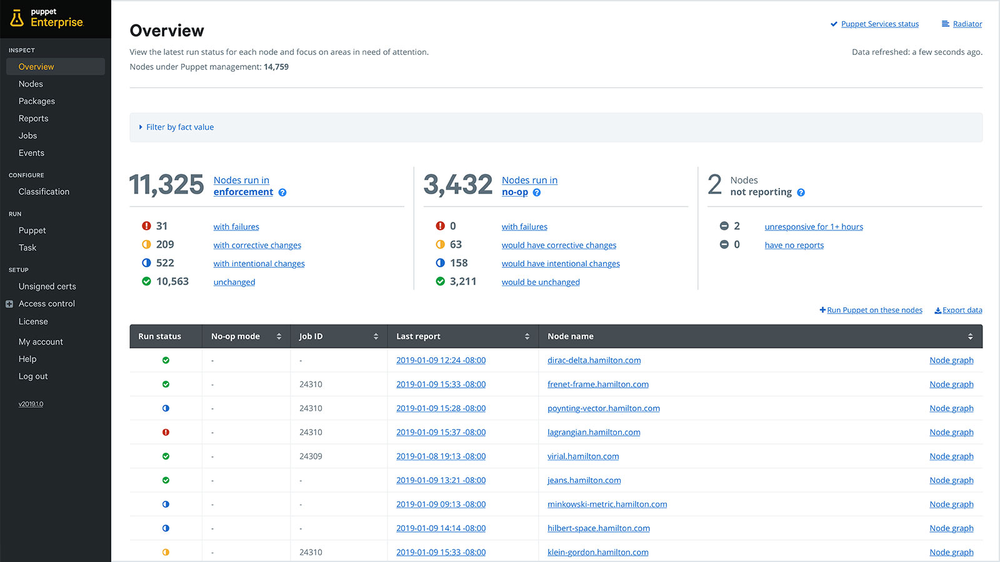
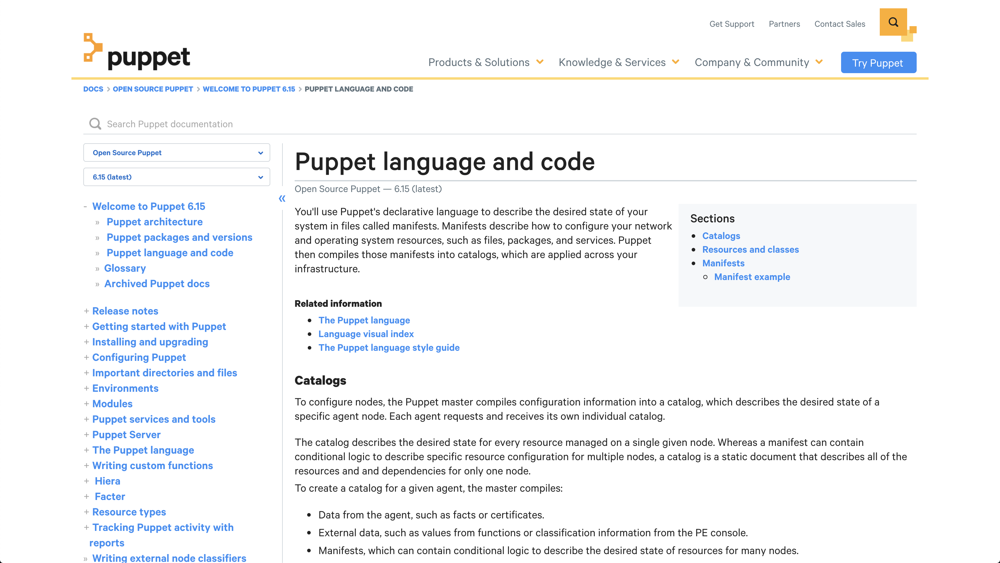
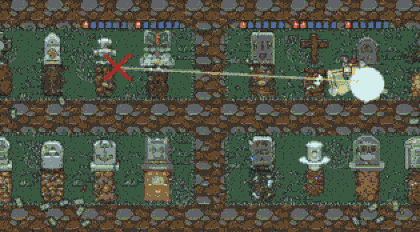
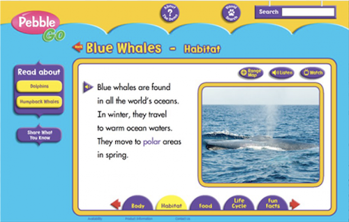
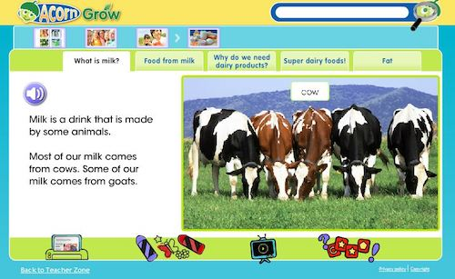

## Here are some projects I have contributed to:

### Puppet Enterprise

**I helped** as a software engineer on a Full Stack team of developers. We used Ember.js, Typescript, and Clojure. My team's focus was improving the time to value for new customers, making navigation more intuitive, and maintaining and implementing accessibility standards to all parts of the application. I also acted as Scrum Master for my team, as well as demoed some of our recent improvements to the console internally to the company and to customers on the community slack.

### Puppet

**I helped** develop solutions to bugs and feature requests for this product in Ruby, as part of a team of platform developers. I acted as the team's Agile Team Lead, coordinated with our Project Owner and Product Managers to make sure the team had work ready for them and had help they needed from adjacent teams.

### Puppet Documentation

**I helped** write, maintain, and edit the documentation for this project as a part of a team of technical writers. I also helped build pipelines to migrate this documentation out of github markdown files for a bespoke jekyll publishing process into a more industry standard DITA solution.

### Grave Man

Grave Man is a game where you are tasked with smashing zombies rising from their graves, picking up money, and trying to avoid having your shovel stolen by ghosts!

**I helped** with this collab as one of the main artists. I created instructional imagery for our more than 25 community collaborators and helped with game QA and testing. Our game made the front page of itch.io for the week of Halloween 2019.  

### myON Reader

myON Reader is an online library used by schools and students around the world.

**I helped** write PHP in an internal framework, write MySQL, stored procedures, and custom data scripts.

### Raintree Online

Raintree is an online book subscription service used by schools and students in the UK.

**I helped** with PHP, MySQL, and JavaScript.

### PebbleGo

PebbleGo is an online collection of themed databases that feature concise articles and games for children around the world.

**I helped** write a PHP script to convert Microsoft Word Documents into XML files, handled Data Asset Management, created video conversion, and managed project workflow.

### AcornGrow

AcornGrow is an online database of consise articles and games that help children learn in the UK.

**I helped** with Data Asset Management, video conversion, and project workflow.

## Volunteering & Other work

I am available for documentary style photography and videography for events that focus on marginalized groups of people. Some events I've enjoyed capturing:

* AlterConf
* Girl Develop It
* Nike's We Code
* Django Girls

I have also participated as a volunteer in these awesome events:

* Girl Develop It
* ClojureBridge
* Midwest Society for Photographic Education

## Personal Projects:

I try to practice and maintain my skills with personal projects regularly. Right now, I'm enjoying creating digital illustrations that I license for use on coloring book apps for iPad:

