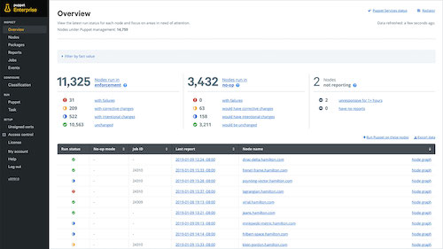

## Here are some projects I have contributed to:

### Puppet Enterprise

**I helped** as a software engineer on a Full Stack team of developers. We used Ember.js, Typescript, and Clojure. My team's focus was improving the time to value for our new customers, making navigation more intuitive, and maintaining and implementing accessibility standards to all parts of the application. I also had an opportunity to be Scrum Master for my team, as well as demo some of our recent improvements to the console to the company internally and on our community slack.

### Puppet

**I helped** develop solutions to bugs and feature requests for this product in Ruby, alongside a team of platform developers. I acted as the team's Agile Team Lead, coordinated with our Project Owner and Product Managers to make sure the team had work ready for them and had help they needed from adjacent teams.

### Puppet Documentation

**I helped** write, maintain, and edit the documentation for this project alongside a team of technical writers. I also helped build pipelines to migrate this documentation out of github markdown files for a bespoke jekyll publishing process into a more industry standard DITA solution.

### Grave Man

Grave Man is a game where you are tasked with smashing zombies rising from their graves, pick up money, and try to avoid having your shovel stolen by ghosts!

**I helped** on this collab as an artist, did game QA and testing, and made instructional imagery for our more than 25 community collaborators!

### myON Reader

myON Reader is an online Library used by schools and students around the world.

**I helped** write PHP in an internal framework, write MySQL, stored procedures, custom data scripts, and more.

### Raintree Online

Raintree is an online book subscription service used by schools and students in the UK.

**I helped** with PHP, MySQL, and JavaScript.

### PebbleGo

PebbleGo is an online collection of themed databases that feature concise articles and games for children around the world.

**I helped** write a PHP script to convert MS Word Documents into XML files, Data Asset Management, video conversion, and with project workflow.

### AcornGrow

AcornGrow is an online database of consise articles and games that help children learn in the UK.

**I helped** with Data Asset Management, video conversion, and project workflow.

## Personal Projects:

I try to practice and maintain my skills with personal projects regularly. Right now, I'm enjoying creating these mandala doodles that I license for use on coloring apps for iPad:

## Volunteering & Other work

I am available for documentary style photography and videography for events that focus on marginalized groups of people. Some events I've enjoyed capturing:

* AltConf
* Girl Develop It
* Nike's We Code
* Django Girls

I have also participated as a volunteer in these awesome events:

* Girl Develop It
* ClojureBridge
* Midwest Society for Photographic Education